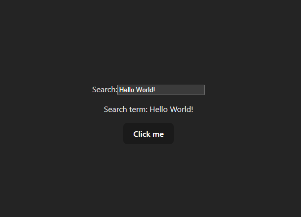

# Simple react form with 2-way data binding

## Overview
This is a simple React application demonstrating the use of the `useState` hook for state management in forms. It's a foundational example for understanding how to handle user input and state updates in React components.

## Live Demo
Check out the live demo [here](https://cecamillo.github.io/react-form-component).

## Features
- **Data Binding**: Implements two-way data binding using the `useState` hook. The input field's value is tied to the component's state.
- **Dynamic State Updates**: Showcases how state changes with every keystroke in the input field.
- **Random Value Generator**: Includes a button to set the input field to a random value, demonstrating state updates from other event handlers.

## UI Snapshot

## Code Structure
- The `App` component is the main component of this application.
- State management is handled using the `useState` hook to track and update the input field's value.
- The input field is controlled by React, with its value set by the component's state and an `onChange` handler to update this state.

## Getting Started
To run this project locally:

1. Clone the repository to your local machine.
2. Navigate to the project directory.
3. Install the dependencies with `npm install`.
4. Start the development server with `npm run dev`.
